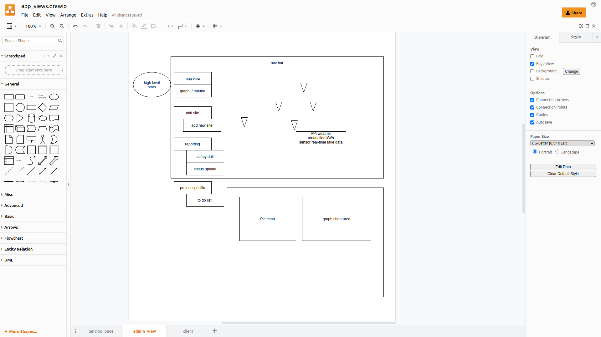
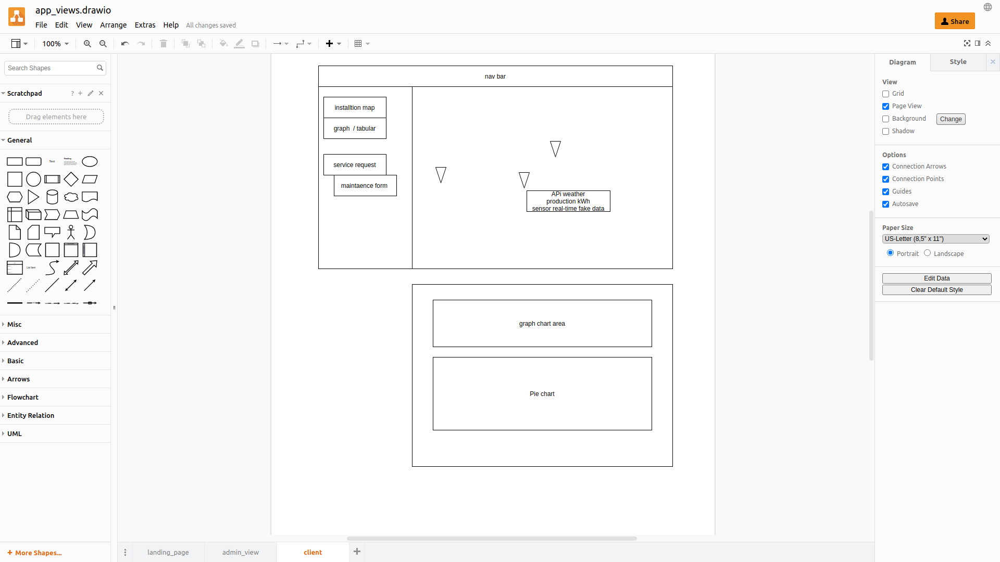

# [PROJECT PLAN]

## Day 1: Project Planning
  [ ] User story ()
  [ ] Wireframe ()
  [ ] SPA vs `MPA`
  [ ] Web app flow ()
  [ ] views mock-up ()
  [ ] ERD ()

## Day 2: Fri Nov 19, 2021

  

## Day 3 Sat Nov 20, 2021
  []

## Day 4 Sun Nov 21, 2021
  []

## Day 5 Mon Nov 22, 2021
  []

## Day 6 Tue Nov 23, 2021

# Web-app Front End Structure

- landing page
  - header 
  - nice backgrond photos slideshow
  - admin login

 - admin dashboard
 
 - customer mini-dashboard

 

## CSS 

# Web-app Back End

## Views

 

## End Points

 `route.use ("/api/orders","/")`

